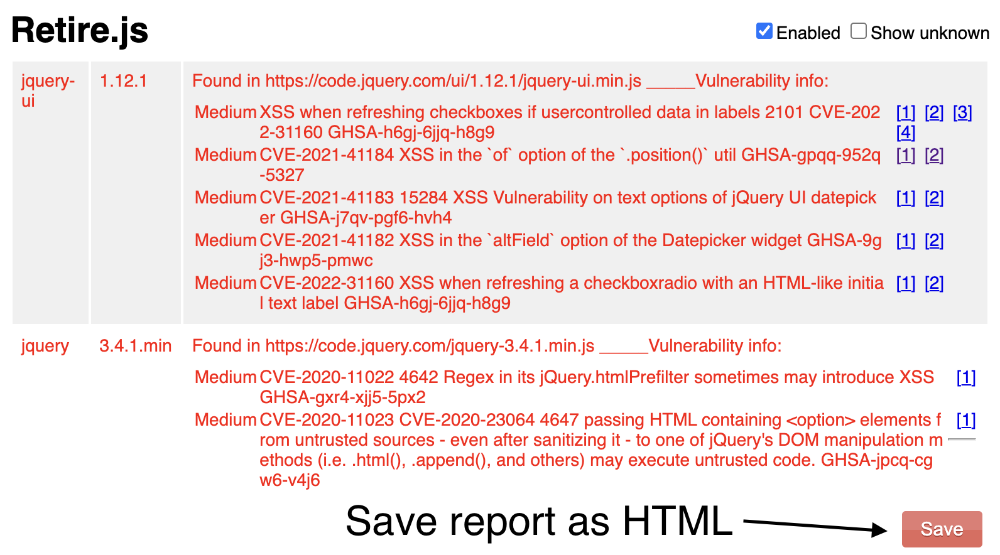

# Retire HTML API Parser

The Retire HTML API Parser consists of a client-side script to parse HTML files generated by the [Retire.js](https://github.com/RetireJS/retire.js) tool and utilizes the Google Custom Search API to add vulnerability data for the identified JavaScript libraries. The consolidated results are then presented to the user in a clear and comprehensive format through the client-side script.

## Requirements
- Python 3.x
- Libraries: `bs4`, `requests`
You can install these using pip: `pip install beautifulsoup4 requests`
- Google Custom Search API key and Search Engine ID

## Setup
1. Clone the repository:

    ```bash
    git clone https://github.com/marksowell/retire-html-api-parser.git
    cd retire-html-api-parser
    ```
2. Replace the placeholders <YOUR_API_KEY> and <SEARCH_ENGINE_ID> in the script with your actual Google Custom Search API key and Search Engine ID, respectively.

## Usage

1. Save the report:


2. Run the script using the following command:

```bash
python retire_parser.py <path_to_html_report>
```
Replace `<path_to_html_report>` with the path to the HTML report generated by `retire.js`.

## License
This project is licensed under the MIT License - see the [LICENSE](LICENSE) file for details.
